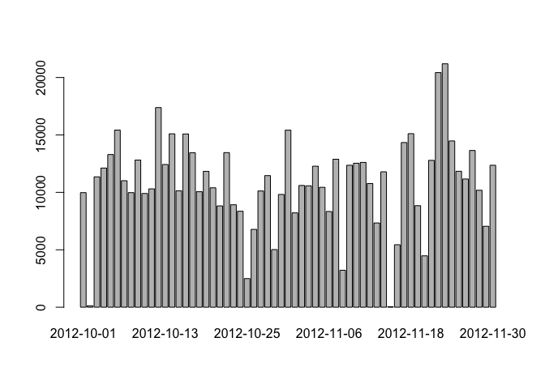

# Reproducible Research: Peer Assessment 1


## Loading and preprocessing the data

```r
activity <- read.csv(file="activity.csv", colClasses=c("integer", "Date", "integer"))
activity$dayofweek <- weekdays(activity$date)
act <- na.omit(activity)
```

## What is mean total number of steps taken per day?

```r
bydate <- aggregate(act$steps, by=list("date"=act$date), FUN=sum)
barplot(bydate$x, names.arg=bydate$date)
```

 

```r
# Mean number of steps taken per day
mean(bydate$x)
```

```
## [1] 10766.19
```

```r
# Median number of steps taken per day
median(bydate$x)
```

```
## [1] 10765
```

## What is the average daily activity pattern?

```r
byinterval <- aggregate(act$steps, by=list("interval"=act$interval), FUN=mean)
plot(byinterval$interval, byinterval$x, type='l', xlab="Interval", ylab="Average Steps")
```

 

```r
# Maximum average steps are in interval 
byinterval[which.max(byinterval$x),1]
```

```
## [1] 835
```

## Imputing missing values
There are 2304 missing values in the data set.

```r
sum(is.na(activity$steps))
```

```
## [1] 2304
```

```r
int <- aggregate(act$steps, by=list("day"=act$dayofweek, "interval"=act$interval), FUN=mean)

activity_full <- activity
for (day in unique(int$day)) 
  {
  for (i in (int$interval[which(int$day == day)]))
  {
    activity_full$steps <- ifelse(is.na(activity_full$steps) & activity_full$dayofweek == day & activity_full$interval == i,int$x[which(int$day == day & int$interval == i)], activity_full$steps)
   }
}

bydatefull <- aggregate(activity_full$steps, by=list("date"=activity_full$date), FUN=sum)
barplot(bydatefull$x, names.arg=bydatefull$date)
```

 

```r
# Mean number of steps taken per day
mean(bydatefull$x)
```

```
## [1] 10821.21
```

```r
# Median number of steps taken per day
median(bydatefull$x)
```

```
## [1] 11015
```

## Are there differences in activity patterns between weekdays and weekends?

```r
activity_full$daytype <- ifelse(activity_full$dayofweek == "Saturday" | activity_full$dayofweek == "Sunday", "weekend","weekday")
activity_full$daytype <- as.factor(activity_full$daytype)
weekday_patterns <- aggregate(activity_full$steps, by=list("daytype"= activity_full$daytype, "interval" = activity_full$interval), FUN=mean)

library(lattice)
xyplot(x ~ interval | daytype, data=weekday_patterns, layout=c(1,2), type='l', groups=daytype, main="Average Steps Weekday vs Weekend", ylab="Number of Steps", xlab="Interval")
```

 
